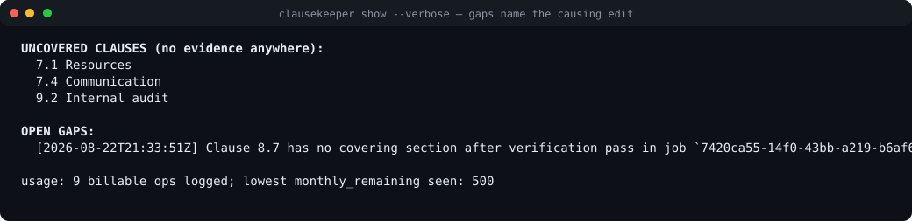
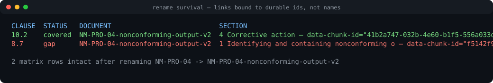
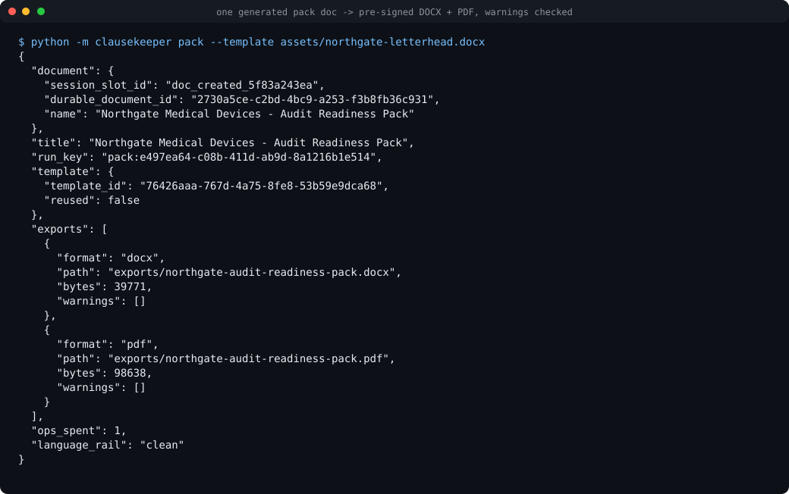

# clausekeeper

Holds a fictional medical-device company's quality manual and procedure set in one
SuperDocs multi-document session, maps every ISO 9001:2015 clause to the document
sections that cover it, re-checks the mapping whenever a procedure is edited, raises
orphaned clauses as gaps **naming the exact edit that caused them**, and never
re-triggers on its own output.

Built for the SuperDocs builds showcase. Credit: sambaths (github.com/sambaths).

## What it does

- `init` — bootstraps one SuperDocs multi-document session: uploads the demo QMS
  corpus (quality manual + 5 procedures), saves each document once to bind permanent
  `durable_document_id`s, and records roles (`manual` / `procedure`).
- `link` — builds the traceability matrix: one compact-mode chat turn per document
  maps every ISO clause in scope to its covering section with provenance
  (`chunk_id`, heading path, verbatim quote). Costs ~1 op per document.
- `edit` — guided edit through SuperDocs' human-approval flow. When an approved edit
  deletes or rewrites a section that was evidence for a clause, a gap lands in the
  matrix **synchronously during approve-response processing**, with a narrative like:
  > Clause 8.7 lost its evidence: section 'Disposition of nonconforming devices' was
  > deleted by edit `chg_42` at 2026-08-22T14:02:00Z, instruction 'remove the NCR
  > section', job `job_9f2`.
- `recheck --plan` — zero-spend preview: affected documents, affected clauses, and an
  op estimate computed from free calls only (roster change flags, doc-events feed,
  local diff state). No billable turn is made.
- `recheck` — one batched verification turn per changed document (~1 op/doc), updates
  link statuses, restores coverage where evidence still exists.
- `show` — prints the matrix, uncovered clauses, open gaps with their attribution
  narratives, and cumulative usage.
- `pack` — generates **one** in-session audit-readiness document on your uploaded
  letterhead template (traceability matrix table + summary page: coverage %, open
  gaps with attribution narratives, stale checks, last-verified dates, honest-limits
  paragraph) and exports it as DOCX and PDF through SuperDocs' pre-signed download
  lane — checking `X-Export-Warnings` every time.

The matrix lives in local SQLite (`clausekeeper.db`, see `schema.sql`) keyed on the
permanent Files UUID, so renaming a document never breaks links — display names just
refresh from rename events.

## The demo in three frames

Captured from real command output during the live run (rendered as stills; no
restaging):

<p align="center">
  
</p>
<p align="center">
  
</p>
<p align="center">
  
</p>

The branded pack itself ships in `exports/` (`northgate-audit-readiness-pack.docx`
and `.pdf`) — one document on the uploaded Northgate letterhead template
(`assets/northgate-letterhead.docx`, generated by `tools/make_letterhead.py`),
uploaded once via `POST /v1/templates/upload` and reused for every later pack.

## Never-re-trigger guard (four independent layers)

1. **Roles** — only `manual`/`procedure` documents enqueue rechecks; generated
   artifacts (audit packs) never do.
2. **Echo suppression** — change events whose origin job is one of ours are ignored;
   our job ids are recorded locally at creation time.
3. **Idempotency** — recheck runs are keyed by `(document_slot, content hash)`; the
   same version is never verified twice.
4. **Write isolation** — clausekeeper writes into procedure documents only through
   the HITL-approved edit flow; generated output would land in new docs only.

## Cost discipline

- Every billable response's usage fields (`ops_charged`, `monthly_remaining`,
  `quota_exhausted`) are logged to `usage_log`.
- The run aborts if `monthly_remaining` drops below a safety floor (default 50,
  configurable via `CK_OPS_FLOOR`).
- Per-run max-turns cap (`CK_MAX_TURNS`, default 12) and per-call WARN_AFTER /
  MAX_WAIT timers follow SuperDocs' documented latency table; polling never runs
  unbounded.
- A full small-sample cycle (init → link → guided edit → plan → recheck) costs about
  8 ops; adding the branded pack generation and both exports lands the whole demo
  story around 9–10 ops. Exports and template upload are free; only the pack
  generation turn is billable.

## Demo corpus

`corpus/northgate/` contains the fictional **Northgate Medical Devices** QMS: a
quality manual plus five procedures. Two deliberate coverage holes are seeded and
recorded in `corpus/northgate/expected-gaps.yaml` *before* any detection run:

- clause **9.2 Internal audit** — no document describes an audit program;
- clause **7.4 Communication** — no document defines communication channels.

The scripted demo edit deletes the *Disposition of nonconforming devices* section
from NM-PRO-04; clause **8.7** must orphan synchronously with full attribution.

## Setup

```bash
pip install -r requirements.txt
export SUPERDOCS_API_KEY=your-superdocs-key   # never commit or log this
python -m clausekeeper init                 # live session against api.superdocs.app
python -m clausekeeper link
python -m clausekeeper show
```

Alternatively, put `SUPERDOCS_API_KEY=…` in a `.env` file next to this README —
the CLI loads it automatically (the file is gitignored).

Optional env vars: `SUPERDOCS_BASE_URL`, `CK_OPS_FLOOR`, `CK_MAX_TURNS`,
`CK_POLL_INTERVAL`.

## Keyless mode

All parsing, attribution, guards, and budgeting logic is unit-tested against recorded
response fixtures (`tests/fixtures/`) — no key needed:

```bash
pytest
python -m clausekeeper --fixture tests/fixtures/init_link.json init
python -m clausekeeper --fixture tests/fixtures/init_link.json link
CK_AUTO_APPROVE=1 python -m clausekeeper --fixture tests/fixtures/edit_delete.json \
    edit NM-PRO-04 --instruction "Delete the disposition section"
python -m clausekeeper --fixture tests/fixtures/events_recheck.json recheck --plan
python -m clausekeeper --fixture tests/fixtures/events_recheck.json recheck
# keyless pack demo on a scratch database (init first to bind the demo session):
python -m clausekeeper --fixture tests/fixtures/init_link.json \
    --db /tmp/ck-pack.db init
python -m clausekeeper --fixture tests/fixtures/pack_flow.json \
    --db /tmp/ck-pack.db pack \
    --template assets/northgate-letterhead.docx --out /tmp/ck-exports
python -m clausekeeper --db clausekeeper.db show
```

Without a terminal, `edit` refuses to decide unless `CK_AUTO_APPROVE=1` is set
explicitly — approval decisions are never silently auto-made.

## SuperDocs features used

Multi-document sessions (roster + durable ids + save-once binding), async chat with
the item-by-item approval flow (`approval_mode: ask_every_time`, batched decisions),
compact response mode with `chunk_diffs`, the doc-events change feed with cursor,
free structure reads for cheap verification, the templates surface (upload-once
letterhead branding), pre-signed downloads (`POST /v1/downloads`) with the
`X-Export-Warnings` header decoded and surfaced, and per-response usage accounting.

## Honest limits

Readiness statements here are assessments against the ISO 9001:2015 *clause
structure* only — not an audit, they grant no formal standing, and no
external body has reviewed them. The clause
library ships official identifiers and titles plus clausekeeper's own original
"what an auditor looks for" notes; no standard body text is reproduced. Verification
quality depends on the model tier behind the session; gaps can be false positives
until a human reviews them at the approval flow.
